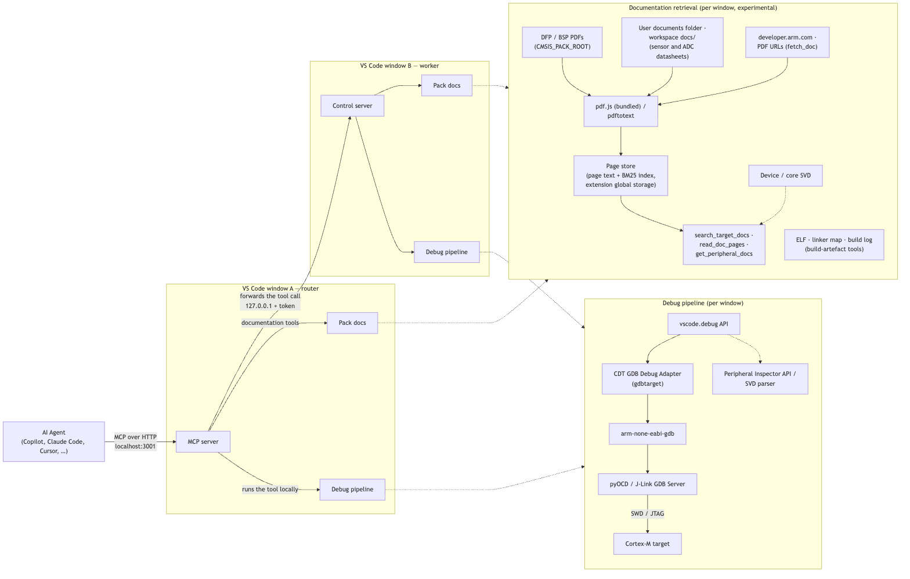

[](https://github.com/Open-CMSIS-Pack/CMSIS-Developer-Assistant/blob/main/LICENSE)
[](https://securityscorecards.dev/viewer/?uri=github.com/Open-CMSIS-Pack/CMSIS-Developer-Assistant)
[](https://github.com/Open-CMSIS-Pack/CMSIS-Developer-Assistant/actions/workflows/ci.yml?query=branch:main)
[](https://github.com/Open-CMSIS-Pack/CMSIS-Developer-Assistant/actions/workflows/markdown.yml?query=branch:main)
[](https://github.com/Open-CMSIS-Pack/CMSIS-Developer-Assistant/actions/workflows/codeql.yml?query=branch:main)
[](https://github.com/Open-CMSIS-Pack/CMSIS-Developer-Assistant/actions/workflows/dependency-review.yml?query=branch:main)

# CMSIS Developer Assistant

> &#8505;&#65039; **About this extension**
>
> - The CMSIS Developer Assistant originated as a fork of [DebugMCP](https://github.com/microsoft/DebugMCP) by Microsoft and is now developed independently by Arm within the [Open-CMSIS-Pack](https://www.open-cmsis-pack.org/) project.
> - Version numbers were inherited from DebugMCP and continue its 2.x line; they do not start at 1.0.
> - The extension is **experimental** and published as a pre-release. Tools, parameters, and settings may change between releases.

The Arm® CMSIS Developer Assistant extension connects AI coding agents to the debugger in Visual Studio Code. It runs a local [Model Context Protocol](https://modelcontextprotocol.io/) (MCP) server that exposes the debug session as tools, so that an agent can drive the [Arm CMSIS Debugger](https://marketplace.visualstudio.com/items?itemName=Arm.vscode-cmsis-debugger) against Arm Cortex®-M devices the same way a developer does: build, flash, run to a breakpoint, and look at the target.

- Starts the CMSIS Solution actions (build, load, load & debug, attach) and controls execution with breakpoints, logpoints, and stepping.
- Reads memory, core registers, and device peripheral registers (from CMSIS-SVD), decodes fault status registers, and measures cycles with the DWT counter.
- Programs Flash, resets the target, and communicates over serial (UART) ports.
- Works with GitHub Copilot, Claude Code, Claude Desktop, Cline, Cursor, Codex, Roo Code, Antigravity, and any other MCP-compatible assistant.
- Runs entirely on the local machine: the MCP server binds to `localhost` only, needs no credentials, and sends nothing to an external service.
- Also debugs applications in other languages (Python, JavaScript/TypeScript, Java, C#, C/C++, Go, Rust, PHP, Ruby) through the respective VS Code debug extensions.
- Eight palette commands (**CMSIS Developer Assistant: …**) cover the human side: registering agents and choosing skills, choosing the target window when several VS Code windows are open, and — with the experimental documentation system — listing, indexing and importing the target's documentation and opening the Pack Docs panel. See [Commands](#commands).

For Arm Cortex-M targets, use it together with these extensions (all included in the [Arm Keil® Studio pack](https://marketplace.visualstudio.com/items?itemName=Arm.keil-studio-pack)):

- [Arm CMSIS Debugger](https://marketplace.visualstudio.com/items?itemName=Arm.vscode-cmsis-debugger) provides the `gdbtarget` debug configuration and ships pyOCD and GDB. It includes the [CDT™ GDB Debug Adapter](https://marketplace.visualstudio.com/items?itemName=eclipse-cdt.cdt-gdb-vscode), the [Peripheral Inspector](https://marketplace.visualstudio.com/items?itemName=eclipse-cdt.peripheral-inspector), and the [Serial Monitor](https://marketplace.visualstudio.com/items?itemName=ms-vscode.vscode-serial-monitor).
- [Arm CMSIS Solution](https://marketplace.visualstudio.com/items?itemName=Arm.cmsis-csolution) generates the `launch.json` from a _csolution project_ and provides the build, load, and debug actions that the agent drives.

## Installation

Download the `cmsis-developer-assistant-<platform>-<version>.vsix` for your host from the [GitHub releases](https://github.com/Open-CMSIS-Pack/CMSIS-Developer-Assistant/releases) and install it:

```sh
code --install-extension cmsis-developer-assistant-<platform>-<version>.vsix
```

Reload the VS Code window afterwards. To build the extension from source, see [CONTRIBUTING.md](CONTRIBUTING.md).

### Connecting an AI agent

The extension activates on startup and serves MCP at `http://localhost:3001/mcp`. GitHub Copilot in VS Code finds the server automatically through the registered `McpServerDefinitionProvider`; nothing needs to be edited.

For other agents, the extension shows a three-step setup on first activation: step 1 writes the server into the configuration of every agent you select, step 2 lets you choose the [agent skills](#agent-skills) to install, and step 3 offers to add the [tool rules](#tool-rules-in-your-agents-rule-files) to your agents' rule files, each change shown as a diff before it is written. The setup can be opened again at any time with the command **CMSIS Developer Assistant: Configure Agents and Skills** from the [command palette](https://code.visualstudio.com/docs/getstarted/userinterface#_command-palette). For manual registration, see [Manual agent registration](#manual-agent-registration).

If an agent has the server registered but none of the CMSIS AI Skills has been selected, the extension offers to install them — at most once a month, with **Select Skills**, **Later** and **Don't ask again** — until a skill from the pack is added (setting `cmsis-developer-assistant.aiSkills.promptOnDetect`).

> &#128204; **TIP**
>
> Enable auto-approval for the CMSIS Developer Assistant tools in your AI assistant. A debug session is a long series of small tool calls, and confirming each one interrupts the workflow.

## Getting Started

1. Open a _csolution project_ in VS Code. The Arm CMSIS Solution extension generates a `.vscode/launch.json` with a CMSIS Debugger configuration (for example `CMSIS Debugger: pyOCD` or `CMSIS Debugger: J-LINK`).
2. Make sure your AI assistant lists the CMSIS Developer Assistant as an MCP server.
3. Ask the agent to debug, for example: _"Load and debug the application, then stop at `main`."_ The agent calls `cmsis_action` with `load_and_debug`, which builds if required, programs the device, and attaches the debugger in one step.
4. Continue in natural language: _"Why do we end up in the HardFault handler?"_, _"Show the GPIOA registers"_, _"Read 64 bytes at the stack pointer"_. The agent uses the inspection tools described below and reports what it found.

The extension also installs four agent skills into your personal skills directories: `cmsis-debug-live`, which teaches the agent a systematic workflow for firmware debugging on hardware, from target-state checks to HardFault root-cause analysis; `add-board-layer`, which authors a board layer for a new csolution target by interviewing you for the few decisions the packs and the pack documentation cannot answer; `cmsis-pack-docs`, which teaches page-cited lookups in the target's pack documentation (once the documentation tools are enabled); and `cmsis-help`, which answers "what can I ask the CMSIS Developer Assistant for?" — the slash commands, VS Code commands, tools and settings. Agents that support the [agent skills](https://agentskills.io/) format pick them up automatically. More skills are available on request — see [Agent skills](#agent-skills).

> &#128221; **Note:**
>
> `cmsis_action` is the preferred way to start a Cortex-M debug session. The generic `start_debugging` tool launches a named `launch.json` configuration without the Flash download step and is meant for other languages.

## Commands

Everything the agent does goes through the MCP tools below; the commands are for you. Open the [command palette](https://code.visualstudio.com/docs/getstarted/userinterface#_command-palette) and type **CMSIS Developer Assistant** to find them.

| Command | What it does |
|---------|--------------|
| **Configure Agents and Skills** | The first-run setup, on demand: pick the AI agents to register the MCP server with (their configuration files are written for you), pick the AI Skills Pack skills to install, then pick the rule files that get the [tool rules](#tool-rules-in-your-agents-rule-files). Run it again after installing a new agent, or to take the rules out of a file. |
| **Select Agent Skills** | Just the skills step: choose category entry points (`cmsis-project`, `cmsis-bring-up`, `cmsis-pack`) or individual skills from the [AI Skills Pack](#agent-skills); the four bundled skills are always installed. |
| **Select Target Window** | With several VS Code windows open: choose the window that agent calls go to when nothing else names one, or **Automatic** to clear the choice. A click on the **CDA** item in the status bar opens it too; see [Networking and multiple windows](#networking-and-multiple-windows). |
| **Release Serial Port** | Takes back a serial port an agent holds in this window, so the Serial Monitor or a terminal can open it; the agent is told why when it next uses the port. While a port is held, the status bar shows **Serial: COM7 (agent)**, and a click on it runs this command. See [Serial ports](#serial-ports). |
| **List Target Documentation** | Writes the current csolution target's document list — pack manuals and datasheets, Arm documents for the core, your imported and workspace PDFs, each with its index state — to the _CMSIS Developer Assistant_ output channel. The same list the agent gets from `list_target_docs`. |
| **Index Target Documentation** | Extracts and indexes every PDF of the current target now, with a progress notification, so the agent's first search is instant instead of paying for extraction. |
| **Import Document for Current Target** | Adds PDFs the packs do not ship — a sensor or ADC datasheet, an NDA reference manual — to the user documents folder: pick the files, attribute them to the current pack, device family, board, core or all targets, give a title, category and edition, and they are indexed at once. |
| **Open User Documents Folder** | Reveals that folder (`packDocs.userDocsDir`, default `~/.cmsis-pack-docs/user`) in the file manager, for dropping documents in by hand or editing `docs.json`. |
| **Open Pack Docs Panel** | A panel showing the resolved target and its documents with their index state, the SVD peripherals with register bit fields, the page store — with two housekeeping actions, each behind a confirmation: _clear extracted text_ (drops every document's extracted pages and search index, re-extracted on next use; downloads stay) and _delete downloaded PDFs_ (removes what `fetch_doc` downloaded, so those documents show as "not fetched" again) — and a runner that executes the documentation tools in place — for checking what the agent will see. |
| **Copy Recent Problems** | Copies the last 50 warnings and errors this window recorded — failed debug-adapter requests, GDB-server errors, failed CMSIS tasks and build errors with file and line, Problems-panel errors, notifications, serial ports that went away — with time, source and next step, to paste into a bug report instead of a screenshot. The same records the agent reads with `get_recent_problems`; each is also written to the _CMSIS Developer Assistant_ output channel as `[problem #N] …`. |

The five documentation commands work whether or not the documentation tools are enabled for agents (`cmsis-developer-assistant.packDocs.enabled`); they need a built csolution in the workspace to resolve the target, or fall back to asking you which pack and device to attribute a document to.

## Agent Tools

Every tool that touches the hardware accepts an optional `timeoutMs` parameter (capped at 60 s by the server; 600 s for `cmsis_action` and `flash`) and always returns within that deadline, even if the probe stalls.

### CMSIS Solution actions

| Tool | Description |
|------|-------------|
| `cmsis_action` | Runs the action buttons of the CMSIS Solution view: `build`, `load`, `erase`, `load_and_run`, `load_and_debug`, `attach`, `detach`, `stop_run`. `load_and_debug` builds (if needed), programs the device, and attaches the debugger in one step. Every result names the target-type / target-set it ran on; the optional `target` (`MPS3` or `HP@debug`) switches a differing one first and verifies it through the extension. Each run is followed as a job: the result names the task, its exit code and the job; a task still running when the wait ends answers with status `running`, `status` waits for it, and a repeated call attaches to it instead of starting it again. A failed `build` adds its error lines with file and line: those csolution recorded in `cbuild-idx.yml`, else those of a diagnostic re-run of `cbuild --log` (setting `build.diagnosticRerun`). Probe actions are refused while a CMSIS Run task, a flash or a debug session holds the probe. |

### Run control

| Tool | Description |
|------|-------------|
| `start_debugging` | Starts a debug session from a named `launch.json` configuration, or from a source file for languages with auto-generated configurations. Refuses if a session is already active. Without a configuration name it asks you in a picker, and gives up after 30 s (at most 60 s) with the names the agent can pass. |
| `stop_debugging`, `restart_debugging` | Stops the current session, waiting at most 10 s for VS Code to end it, or restarts it and waits until it is ready again. |
| `pause_execution` | Halts a running target without ending the session. |
| `continue_execution`, `step_over`, `step_into`, `step_out` | Resume or step. If the target does not stop within the deadline, the tool pauses it and reports where the firmware actually was. |
| `wait_for_stop` | Blocks until the target stops next (breakpoint, fault, step, pause) and returns the stop reason, or a structured timeout. Replaces blind waiting after a `continue_execution`. |
| `reset` | Resets the target inside the live session (breakpoints survive) and verifies that the program counter is at the reset vector afterwards. Selects the method (`auto`, `system`, `core`, `hardware`) and reports honestly when the target did not reset. |

### Breakpoints

| Tool | Description |
|------|-------------|
| `add_breakpoint` | Sets a breakpoint at a source line, optionally with a condition, and reports whether the debugger bound it. GDB tests a condition at every hit, halting the core briefly each time, and the target stops only when it holds. On a running target the tool pauses it to apply the change and resumes it. |
| `add_logpoint` | Prints a message and resumes instead of halting (GDB `dprintf`). Expressions are interpolated with `{expr}`; `{expr:%s}` overrides the format. |
| `remove_breakpoint`, `clear_all_breakpoints`, `list_breakpoints` | Breakpoint management. |

### Inspection

| Tool | Description |
|------|-------------|
| `list_variable_names` | Names and types of the variables in scope, without reading their values. |
| `get_variables_values` | Values of local, global, or all variables of the active frame, or of up to 50 named variables. |
| `evaluate_expression` | Evaluates an expression in the current frame. |
| `get_call_stack`, `get_threads` | Full call stack with frame IDs, and the thread list. With RTOS-aware GDB servers (pyOCD `--rtos`, J-Link plugin) the threads are the FreeRTOS, RTX, or ThreadX tasks. |
| `get_frame_variables` | Variables of an explicit frame without changing the active editor frame. |

### Cortex-M

| Tool | Description |
|------|-------------|
| `read_memory` | Reads a range of bytes (up to 4096) from the target as hex, ASCII, or both. |
| `read_core_registers` | Reads R0–R15, xPSR, MSP, PSP, CONTROL, FAULTMASK, BASEPRI, and PRIMASK. |
| `read_peripheral_register` | Reads and decodes a peripheral register, or all registers of a peripheral, using the CMSIS-SVD description of the device (via the Peripheral Inspector or a built-in SVD parser). |
| `get_fault_info` | Reads CFSR, HFSR, DFSR, MMFAR, BFAR, and AFSR and decodes them bit by bit for HardFault analysis. |
| `diagnose_fault` | One-call fault triage: decoded fault registers, the stacked exception frame (faulting PC and its caller), the top frames, the faulting address resolved against the SVD, and up to three ranked hypotheses each with the next tool call. |
| `lookup_peripheral` | Answers from the SVD without touching the target, with or without a session: the peripheral list, a peripheral's register map, or which peripheral and register sit at an address (resolve a BFAR). |
| `lookup_register` | Describes one register from the SVD: address, access, reset value, bit fields with enumerated values — which bit is the clock enable, before reading anything. |
| `read_cycle_counter` | Reads the DWT cycle counter for cycle-accurate timing between two stops. Enables the counter on first use and reports cores without one. |
| `flash` | Programs the Flash with `pyocd load --cbuild-run` outside a debug session and returns bytes programmed or the structured pyOCD error. Uses the pyOCD bundled with the Arm CMSIS Debugger; refused while a debug session or a CMSIS Run task holds the probe. |
| `get_device_info` | Returns device, probe, processor, GDB server, ports, and the `*.cbuild-run.yml` of the session. |

### Serial ports

| Tool | Description |
|------|-------------|
| `serial_list_ports` | Lists the serial ports (via the Serial Monitor extension, falling back to the bundled `serialport` package). |
| `serial_capture` | Shows what the board prints, in one call: opens the port, sends `write` if given, reads until the regex `until` matches or `durationMs` (up to 60 s) runs out, and closes the port again, also when something fails. Answers with at most 16 kB, the first and the last 8 kB, why it stopped and how long it took. Refused with `PORT_HELD` while the window holds a port or another program holds this one. It does not reset the target. |
| `serial_open`, `serial_close`, `serial_write`, `serial_read`, `serial_status`, `serial_clear_buffer` | Owns a serial connection from the MCP server, one port per window. Use these when no Serial Monitor session holds the same port; if another program holds it, `serial_open` fails with `PORT_HELD`. When the adapter is unplugged the port is released: `serial_status`, `serial_read` and `serial_write` say so and when, and the bytes received before stay readable. |
| `serial_open_monitor` | Opens the Serial Monitor panel for the user. |
| `serial_subscribe_monitor`, `serial_unsubscribe_monitor` | Reads data through an open Serial Monitor session once the Serial Monitor extension exposes a data event in its API (see [Known Limitations](#known-limitations-and-workarounds)). |

A port an agent opened is not held forever. On Windows a COM port has a single holder, so a port the agent forgot would keep the Serial Monitor out. The port is released after `serial.idleCloseSeconds` (300 s) without a serial tool call, and when the agent's MCP session ends: when the client disconnects, or after 30 minutes without a request. `serial_open` takes `releaseOn` to change that: `debug-session-end` releases the port when the debug session in the window ends instead of after idle time, `manual` keeps it until `serial_close`, for soak tests. After a release, `serial_read` returns the bytes received before with the reason, and `serial_write` fails with `PORT_CLOSED`. A Serial Monitor subscription follows the same idle and session rules.

While an agent holds a port, the status bar shows **Serial: COM7 (agent)**. Its tooltip gives the baud rate, since when, the agent's session and when the port will be released; a click releases it at once (**Release Serial Port**). `get_session_status` tells the agent the same, and `flash` and `cmsis_action load`, `erase` and `load_and_run` remind it that the probe's virtual COM port may re-enumerate while the target is programmed.

### Documentation (experimental, off by default — `cmsis-developer-assistant.packDocs.enabled`)

Page-cited answers from the documentation of the current csolution target: the reference manuals, datasheets, errata and board manuals its DFP/BSP ship or link, the Arm documents for the device's core (architecture reference manual, ADIv5/ADIv6, CoreSight and core TRMs), the shipped Cortex-M core-peripheral SVDs, and your own PDFs. PDFs are extracted with the bundled pdf.js (or `pdftotext` from poppler when `packDocs.extractor` says so) and indexed on first use; the text stays in the extension's global storage. The `cmsis-pack-docs` skill teaches the workflow.

| Tool | Description |
|------|-------------|
| `list_target_docs` | Lists the target's documents with ids and their state (indexed, not yet, web link, missing). Resolves the target from `*.cbuild-run.yml`; `pack` + `device` when there is no build. |
| `search_target_docs` | Searches the documents page by page for register names, bit names, addresses or quoted phrases; returns ranked pages with section and snippet. |
| `read_doc_pages` | Reads pages of a document by id (`"519"`, `"519-521"`); cite as `<id> <edition> p.<n>`. |
| `fetch_doc` | Downloads a web-linked document (an arm.com book or Arm document id such as `ddi0553`, or a direct PDF URL) into the cache and indexes it — the only call that downloads. |
| `get_peripheral_docs` | A dossier for one peripheral instance (`USART1`, `TIM2`): registers from the SVD, the manual chapters and per-register pages, the RCC clock-enable/reset bits, interrupt vectors, errata mentions — all page-cited. |

Documents the packs do not ship take two routes: the **user documents folder** (`packDocs.userDocsDir`, default `~/.cmsis-pack-docs/user`, outside any workspace and shared by every project; sub-folders such as `Keil/STM32U5xx_DFP/`, `devices/STM32U5*/`, `boards/<name>/`, `cores/Cortex-M33/` say which targets see a file — the command **Import Document for Current Target** does the attribution, title, category and indexing for you) and the workspace folders `.agent-artifacts/docs/` and `docs/` (`packDocs.workspaceDocDirs`) for project-specific documents. **Open Pack Docs Panel** shows the resolved target, its documents and index state, the SVD peripherals and the page store, and runs the tools in place. Third-party parts on the board — sensors, ADCs, codecs — take the same routes: drop the datasheet into `docs/`, import it, or let the agent `fetch_doc` its URL; the agent is told to start any part-number lookup at `list_target_docs` and never to read a PDF directly.

### Build artefacts (experimental, off by default — `cmsis-developer-assistant.buildInfo.enabled`)

Deterministic reads of the current target's build output — no debug session needed.

| Tool | Description |
|------|-------------|
| `list_build_artifacts` | Compiler, ELF/AXF, map, hex, newest build log, sizes and times, and the device memory regions from `*.cbuild-run.yml`. |
| `get_memory_usage` | Flash/RAM usage per region from the ELF and linker map, the largest symbols and the heaviest objects and libraries. |
| `lookup_symbol` | A symbol by name — address, size, section, defining object — or the symbol, section and region that contain an address (a fault PC or LR). |
| `get_section_layout` | LOAD segments and allocated sections with address, size, region and the largest contributing objects. |
| `get_build_diagnostics` | Errors and warnings of the newest build log (GCC/Clang/armclang/armlink/CMake/ninja/cbuild) with `file:line` and the final status. |

### Session health

| Tool | Description |
|------|-------------|
| `get_session_status` | Classifies the session as `no-session`, `initializing`, `running`, `stopped`, or `unresponsive`, with a hint for each state, counts the errors recorded since the agent last looked, and names the serial port the window holds or why it was released. Never throws. |
| `get_recent_problems` | The problem journal of the window the session drives: failed debug-adapter requests (including those of breakpoints set in the editor while the target runs), GDB-server errors, failed CMSIS tasks and build errors with file and line, Problems-panel errors, the extension's notifications, serial ports that went away. One line per record with number, severity, source, code and next step; `sinceSeq`, `sources`, `minSeverity` and `limit` narrow it. |
| `check_target_connection` | Low-cost liveness check of the debug adapter and probe. |
| `get_debug_instructions` | Returns the debugging guide for agents that cannot read MCP resources (such as GitHub Copilot): a short overview with the topic list by default, or one section with `topic` (`session`, `build`, `breakpoints`, `inspection`, `faults`, `troubleshooting`). |
| `list_debug_windows`, `select_debug_window` | Shows the VS Code windows the server can reach, with the router and the default target marked and the calls busy in each, and pins one for this session. Relevant when more than one window is open; then `cmsis_action`, `flash`, `reset`, `serial_open` and `serial_capture` also take `window`, a pid or a path inside the window's workspace. |

### MCP resources

- `cmsis-developer-assistant://docs/debug_instructions` — general debugging workflow guide.
- `cmsis-developer-assistant://docs/cmsis-embedded-guide` — Cortex-M debugging knowledge: fault decode recipes, memory map, key system registers, RTOS tips.
- `cmsis-developer-assistant://docs/troubleshooting/embedded` — embedded-specific troubleshooting.
- `cmsis-developer-assistant://docs/troubleshooting/<language>` — troubleshooting for `python` and `cpp` (C and C++).

### Reading results

- A failed call is marked `isError`, and its text starts with the error code in brackets, such as `[NO_SESSION]`, `[TARGET_RUNNING]`, `[TIMEOUT]` or `[PROBE_BUSY]`. The line after the message is the hint: the next call to make.
- `structuredContent` carries the same as fields: `status` (`error`), `error_code`, `message` and `hint`, plus details such as the candidate windows of `AMBIGUOUS_WINDOW`.
- A `structuredContent.status` of `timeout` (a wait ran out; the target still runs) or `running` (a build or attach goes on in the background) is not a failure, and such a result is not marked `isError`.
- A result without `isError` whose status is absent or `ok` is a plain success.
- A failure or a timeout can carry `structuredContent.problems`: up to five records of what the debug adapter, the GDB server or a task reported during the call, each with its code and next step, also listed under "Recent problems:" in the text. When errors were recorded in the window since the agent last looked — a breakpoint the user set in the editor while the target ran, a build started from the CMSIS panel — the next successful result says so once and names the `get_recent_problems` call that lists them.

### Behavior the agent can rely on

- **No tool call hangs.** Every hardware-touching tool returns within 60 s at most (`cmsis_action` and `flash` within the wait they are given, at most 600 s); every request to the debug adapter has its own timeout and fails with a `HardwareTimeoutError` instead of blocking.
- **Inspection tools report the real state.** If the target is running, the call returns a `TARGET_RUNNING` error whose hint names the recovery (`pause_execution`, or a breakpoint and `wait_for_stop`) instead of a misleading "no debug session".
- **Motion tools explain overshoots.** When `continue_execution` or a step does not stop in time, the tool pauses the target and reports the program counter and active frame.
- **`reset` never claims a reset that did not happen.** The program counter is checked against the reset vector; an unverified reset is reported as such, together with the replies of the debug adapter.
- **Calls never run against the wrong board.** With two windows debugging at once, routing fails with the list of candidates instead of guessing, because memory read from the wrong target looks exactly like a firmware bug.
- **Credential-shaped values are withheld** from variable reads and `evaluate_expression` (configurable). Numeric scalars and raw target reads (memory, core and peripheral registers, GDB commands) are never withheld, so the firmware state stays readable.

## Agent Skills

Skills are `SKILL.md` workflows in the [Agent Skills](https://agentskills.io/) format that an agent loads on demand. The extension ships a catalog of them and copies the ones you select into the directories your agents read — for this user, so every workspace has them:

| Directory | Read by |
|-----------|---------|
| `~/.agents/skills/` | GitHub Copilot CLI, Codex, Cursor, Gemini CLI, VS Code Copilot Chat (the cross-agent location) |
| `~/.claude/skills/` | Claude Code (only when a `~/.claude` directory exists; `CLAUDE_CONFIG_DIR` is honoured) |
| `$COPILOT_HOME/skills/` | GitHub Copilot CLI, only when `COPILOT_HOME` is set (it then ignores `~/.agents/skills`) |

or into the current workspace only, next to your sources, where the same agents look for a project's own skills:

| Directory | Read by |
|-----------|---------|
| `<workspace>/.agents/skills/` | GitHub Copilot CLI, Codex, Cursor, Gemini CLI, VS Code Copilot Chat (the cross-agent project location) |
| `<workspace>/.claude/skills/` | Claude Code (when Claude Code is installed or the project already has a `.claude` directory) |

A workspace install carries the selected pack skills and their hidden dependencies only — the extension's own skills stay in your personal directories, where every agent on the machine already finds them — and is yours to commit with the project or add to `.gitignore`. A colleague who opens the project gets the skills either way; one with this extension gets them re-synced from the checked-in setting.

The catalog contains:

- **`cmsis-debug-live`** (always installed) — the live Cortex-M debugging workflow for the tools of this extension.
- **`add-board-layer`** (always installed) — add a board layer to an existing csolution: read the packs and the csolution first, ask only the open decisions (layer strategy, probe, STDIO transport, memory), then reuse the BSP layer, integrate the DFP's configuration generator, or write a minimal bare-metal layer, and build to green. Hardware facts come from the pack documentation (the documentation tools, when `cmsis-developer-assistant.packDocs.enabled` is on) with page cites.
- **`cmsis-pack-docs`** (always installed) — look things up in the target's documentation through the documentation tools: `list_target_docs` → `search_target_docs` → `read_doc_pages`, `fetch_doc` for web-linked and Arm documents, `get_peripheral_docs` for one peripheral; the citation convention, and the protocol the bring-up skills follow before asking the user to download a document. Useful once `cmsis-developer-assistant.packDocs.enabled` is on.
- **`cmsis-help`** (always installed) — the list of CMSIS slash commands, the member skills behind each, the VS Code commands, the MCP tool groups and the settings; generated from the catalog and `package.json` so it cannot go stale. Ask the agent `/cmsis-help`.
- **The [Open-CMSIS-Pack/cmsis-skills](https://github.com/Open-CMSIS-Pack/cmsis-skills) skills**, vendored at a pinned commit (`skills/cmsis-skills.lock.json`): project setup (`add-cmsis-target`, `identify-cmsis-board-support`, `start-zephyr-project`, …), device debug and trace knowledge (`debug-access-knowledge`, `debug-knowledge`, `trace-knowledge`, …), and CMSIS-Pack debug authoring (`generate-debug-sequences`, `generate-trace-sequences`, `manage-pdsc-debugvars`, …).
- **One entry point per category** — `cmsis-project`, `cmsis-bring-up`, `cmsis-pack`. Selecting an entry point gives the agent a single slash command for the whole category: the member skills are installed with `user-invocable: false`, so agents that honour that flag (Claude Code, VS Code, Copilot CLI) keep them out of the `/` menu while the model can still invoke them by description. Selecting an individual skill makes it visible; skills it depends on (the `$name` references in its text) are installed hidden.

The cmsis-skills skills and their entry points form the **AI Skills Pack**. Choose from it with **CMSIS Developer Assistant: Select Agent Skills** (also step 2 of **Configure Agents and Skills**): it first asks where the skills go — **This workspace only** (the default; one entry per folder in a multi-root workspace) or **This user**, each showing what it currently selects — and then which skills. The workspace is the default because a skill in your personal directories is offered to the agent in every project, and its description costs context there whether the project is CMSIS or not; installed into the project, it is loaded only where it applies. Or edit the `cmsis-developer-assistant.installedSkills` setting directly: as a User setting it fills the personal directories, as a Workspace or Folder setting the project's; the two selections are independent, and a workspace selection is applied on top of the user's. The extension's own `cmsis-debug-live`, `add-board-layer`, `cmsis-pack-docs` and `cmsis-help` are always installed personally and are not part of the selection. Every selection is applied on every activation and whenever the setting changes — through Settings Sync, or a `.vscode/settings.json` checked out with the project. Every directory the extension writes carries a `.cmsis-developer-assistant.json` marker; deselected skills with that marker are removed, and a skill you installed yourself is never overwritten or removed, even if it shares a name.

Turning `cmsis-developer-assistant.aiSkills.enabled` off switches the pack off: the pack skills this extension installed are removed (marker-guarded, your own skills are untouched), the skills step of the setup and the install prompt are skipped, and the bundled skills stay. Your selection is kept, so turning it back on restores exactly what you had.

## Tool rules in your agents' rule files

Agents tend to reach for `pyocd`, `gdb`, `cbuild` or `pip install pyocd` in a shell instead of the MCP tools, which fights the running debug session for the probe. The server instructions and the bundled skills therefore start with a short list of tool rules. Skill text can get lost when an agent compacts its context; a rule file is loaded in every session. So step 3 of **Configure Agents and Skills** offers to add the same rules to the files your agents read:

| Agent | This user (preselected) | This workspace |
|-------|-------------------------|----------------|
| Claude Code | `~/.claude/CLAUDE.md` (`CLAUDE_CONFIG_DIR` is honoured) | the project's `CLAUDE.md`; `AGENTS.md` when it has none, because a new `CLAUDE.md` would hide the project's `AGENTS.md` from Claude Code |
| Codex | `~/.codex/AGENTS.md` (`CODEX_HOME`; a non-empty `AGENTS.override.md` wins, as in Codex) | `AGENTS.md` |
| GitHub Copilot CLI | `~/.copilot/copilot-instructions.md` (`COPILOT_HOME`) | `AGENTS.md` |
| Antigravity | `~/.gemini/AGENTS.md` | `AGENTS.md` |
| VS Code Copilot Chat | — | `AGENTS.md` (`.github/copilot-instructions.md` when `chat.useAgentsMdFile` is off) |
| Cursor | — | `.cursor/rules/cmsis-developer-assistant.mdc` (`alwaysApply: true`) |
| Cline | — | `.clinerules/cmsis-developer-assistant.md` |
| Roo Code | — | `.roo/rules/cmsis-developer-assistant.md`, or `.roorules` when the project uses that file |

The step lists the files of the agents you set up in step 1, of the agents that have the server registered already, and of Copilot Chat. A file several agents read, such as a workspace `AGENTS.md`, is listed and written once. The user-level files are preselected: the MCP registration is per user too, and a workspace file ends up in the repository, where colleagues without this extension read it as well. Each change opens a diff of the file as it is against the file with the rules, and a dialog; nothing is written unless you choose **Write**.

The rules go between `<!-- cmsis-developer-assistant:rules:begin -->` and `<!-- cmsis-developer-assistant:rules:end -->`, with a comment saying who manages them; nothing else in the file changes, line endings included. To take the rules out, run the command again and uncheck the file, then choose **Remove**: the file is back to what it was, and a file that was created for the rules is deleted. When a new release of the extension changes the rules, activation updates the blocks it wrote, in place, and logs it; it never adds a block to a file. Set `cmsis-developer-assistant.agentRules.install` to `never` to skip the step and leave every rule file alone. Claude Desktop has no rule file and relies on the server instructions.

## Configuration

| Setting | Default | Description |
|---------|---------|-------------|
| `cmsis-developer-assistant.installedSkills` | `[]` | The AI Skills Pack skills (entry points or individual skills) to install. As a User setting they go into your personal skills directories, as a Workspace or Folder setting into that project's `.agents/skills` only; the bundled `cmsis-debug-live`, `add-board-layer`, `cmsis-pack-docs` and `cmsis-help` are always installed personally. See [Agent Skills](#agent-skills). |
| `cmsis-developer-assistant.aiSkills.enabled` | `true` | Enable the AI Skills Pack for selected agents. Off: pack skills this extension installed are removed, the skills setup step and the install prompt are skipped, the selection is kept. |
| `cmsis-developer-assistant.aiSkills.promptOnDetect` | `true` | Prompt to install the CMSIS AI Skills for selected agents — monthly, until a pack skill is added. |
| `cmsis-developer-assistant.agentRules.install` | `"ask"` | `ask`: step 3 of the setup offers to add the tool rules to your agents' rule files, each change previewed, and activation keeps blocks written earlier current. `never`: the step is skipped and no rule file is touched. See [Tool rules](#tool-rules-in-your-agents-rule-files). |
| `cmsis-developer-assistant.serverPort` | `3001` | Port of the MCP server. One window binds it and routes to the others. Changing the port requires a window reload; the extension offers to reload. |
| `cmsis-developer-assistant.timeoutInSeconds` | `180` | Timeout for debugging operations such as starting a session. |
| `cmsis-developer-assistant.dapRequestTimeoutMs` | `10000` | Per-request timeout for traffic to the debug adapter and probe. Increase for slow targets or large memory reads. |
| `cmsis-developer-assistant.memoryReadTimeoutMs` | `30000` | Overall timeout for a single `read_memory` or `read_core_registers` call. |
| `cmsis-developer-assistant.redactSecrets` | `true` | Withholds variable and expression values that look like credentials. |
| `cmsis-developer-assistant.build.diagnosticRerun` | `true` | After a failed CMSIS build, re-run `cbuild` once with `--log` (no pack download, no RTE update, no clean; incremental, at most 120 s, stopped when another build starts) so that the `cmsis_action build` result shows the error lines with file and line. The log goes to `out/cmsis-developer-assistant/build-diagnostic.log` next to the solution. Off: the result still shows what csolution recorded in `cbuild-idx.yml`. Window scope, applies to the next failed build. |
| `cmsis-developer-assistant.serial.enabled` | `true` | Offer the `serial_*` tools to agents. Off drops the eleven serial tools from the tool list every agent turn carries; needs a window reload. |
| `cmsis-developer-assistant.serial.idleCloseSeconds` | `300` | Release a serial port an agent opened after this many seconds without a serial tool call, so the Serial Monitor or a terminal can have it again; bytes from the board do not count as use. `0` turns the idle release off. Window scope, read at each `serial_open`. |
| `cmsis-developer-assistant.packDocs.enabled` | `false` | **Experimental.** Offer the five documentation tools to agents; window reload. `packDocs.extractor` (`auto` = the bundled pdf.js; `pdftotext` for poppler's `-layout` text), `packDocs.pdftotextPath`, `packDocs.maxPdfMb` (150), `packDocs.includeUnlisted` (true), `packDocs.workspaceDocDirs` (`.agent-artifacts/docs`, `docs`) and `packDocs.userDocsDir` (empty → `~/.cmsis-pack-docs/user`) tune them and apply live. |
| `cmsis-developer-assistant.buildInfo.enabled` | `false` | **Experimental.** Offer the five build-artefact tools to agents; window reload. `buildInfo.maxSymbols` (20) and `buildInfo.logGlobs` (`**/out/**/*.log`, `**/build*.log`) tune them. |
| `cmsis-developer-assistant.telemetry.jsonlPath` | `""` | Append one JSON line per MCP tool call — name, bytes in/out, duration, outcome; never arguments or results — to this file for offline analysis. Off when empty; `get_session_status` and the `cmsis-developer-assistant://stats` resource always show the in-memory statistics. |

### Networking and multiple windows

The MCP server binds to **`127.0.0.1` only** and rejects requests whose `Host` or `Origin` is not a loopback address. It has no authentication and can program, erase, and read the attached hardware, so it must never be exposed to a network. VS Code Remote SSH, WSL, and Codespaces forward `localhost`, so these setups work unchanged.

Several VS Code windows are supported. One window binds `serverPort` and becomes the _router_; every other window runs a token-protected loopback control server and publishes itself to a shared registry. The router forwards each tool call to the window that owns the target, so agents that read a single global configuration (Claude Code, Codex, Copilot CLI) reach every window through one URL. When the router window closes, another window takes over within about ten seconds.

The target window of a call is chosen in this order:

1. The `window` argument of `cmsis_action`, `flash`, `reset`, `serial_open` or `serial_capture`: a process id, or a path inside the window's workspace. The agent's later calls follow it.
2. The file path the tool has (`add_breakpoint`, `start_debugging`).
3. The window the agent pinned with `select_debug_window`.
4. The window the agent's session used last.
5. The **default target** you chose in **Select Target Window**. Choosing it moves every agent session that is not pinned.
6. The one window with an active debug session, then the one window.

When none of these decides, for example with two windows debugging or two idle ones, the call fails and names every window, and the agent asks you or pins one itself.

Every window shows an item in the status bar: **CDA router** or **CDA worker**, with **· default** on the default target and a spinner while an agent call runs in it. Its tooltip names the MCP endpoint, the default target and the last agent call; in the router window it also lists the agent sessions with the window each one drives and why. A click on the item opens **Select Target Window**, which saves your choice for every window. It survives a reload of the chosen window, since the window is found again by its folder. Hide the item from the status bar's context menu (**CMSIS Developer Assistant**) if you do not need it.

A call that hangs in a window ends in time. When a call does not finish, for example because a picker or dialog in that window waits for you, the window tells the agent `WORKER_TIMEOUT` shortly before the router would give up. The call keeps running there: the window shows a warning, and its status-bar item turns to the warning background until the call ends. A window whose extension host is blocked, or that was closed, fails a health check within seconds, and the agent gets `WINDOW_UNREACHABLE` instead of waiting minutes. When the router window itself stops responding, it keeps the port and no other window can take over; the other windows then show a warning that names it. Reload or close that window, and another window takes over automatically.

### Manual agent registration

The popup described in [Connecting an AI agent](#connecting-an-ai-agent) writes these entries for you. If you prefer to do it by hand, the server is reachable at `http://localhost:3001/mcp` (replace the port if you changed `serverPort`).

**GitHub Copilot** (`settings.json`):

```json
{
  "mcp": {
    "servers": {
      "cmsis-developer-assistant": {
        "type": "http",
        "url": "http://localhost:3001/mcp"
      }
    }
  }
}
```

**Cline, Roo Code** (MCP settings):

```json
{
  "mcpServers": {
    "cmsis-developer-assistant": {
      "type": "streamableHttp",
      "url": "http://localhost:3001/mcp"
    }
  }
}
```

**Cursor** (`~/.cursor/mcp.json`, or `.cursor/mcp.json` in one project):

```json
{
  "mcpServers": {
    "cmsis-developer-assistant": {
      "url": "http://localhost:3001/mcp"
    }
  }
}
```

**Claude Code** (terminal):

```sh
claude mcp add --transport http --scope user cmsis-developer-assistant http://localhost:3001/mcp
```

**Claude Desktop** only supports stdio servers, so it gets an `mcp-remote` bridge (requires Node.js with `npx` on the `PATH`) in `claude_desktop_config.json`:

```json
{
  "mcpServers": {
    "cmsis-developer-assistant": {
      "command": "npx",
      "args": ["-y", "mcp-remote", "http://localhost:3001/mcp"]
    }
  }
}
```

## Other Languages

Besides Cortex-M targets, the extension starts and controls debug sessions for other languages through their VS Code debug extensions. Without a `launch.json`, a default configuration is synthesized from the file extension.

| Language | Extension |
|----------|-----------|
| Python | [Python](https://marketplace.visualstudio.com/items?itemName=ms-python.python) |
| JavaScript/TypeScript | Built-in / [JavaScript Debugger](https://marketplace.visualstudio.com/items?itemName=ms-vscode.js-debug) |
| Java | [Extension Pack for Java](https://marketplace.visualstudio.com/items?itemName=vscjava.vscode-java-pack) |
| C/C++ | [C/C++](https://marketplace.visualstudio.com/items?itemName=ms-vscode.cpptools) |
| C#/.NET | [C#](https://marketplace.visualstudio.com/items?itemName=ms-dotnettools.csharp) |
| Go | [Go](https://marketplace.visualstudio.com/items?itemName=golang.Go) |
| Rust | [rust-analyzer](https://marketplace.visualstudio.com/items?itemName=rust-lang.rust-analyzer) |
| PHP | [PHP Debug](https://marketplace.visualstudio.com/items?itemName=xdebug.php-debug) |
| Ruby | [Ruby](https://marketplace.visualstudio.com/items?itemName=rebornix.ruby) |

## How It Works



The diagram source is [assets/architecture.mmd](assets/architecture.mmd) (Mermaid; `npm run diagram` re-renders it). The extension speaks to the debugger through the VS Code debug API and the Debug Adapter Protocol (DAP). It adds nothing on the target side: pyOCD or the J-Link GDB server, GDB, and the debug adapter are the same components that the Arm CMSIS Debugger uses interactively. A named `launch.json` configuration is passed to `vscode.debug.startDebugging()` unchanged, so whatever the CMSIS Solution extension generates is what the agent launches.

One window owns the MCP port and forwards each tool call over a token-protected loopback channel to the window that owns the workspace, so an agent has one URL however many windows are open. The documentation tools follow the same path: in the window that owns the project, the PDFs the target's packs ship (from `CMSIS_PACK_ROOT`), the user's own datasheets and the workspace `docs/` folder are extracted with the bundled pdf.js into a page store in the extension's global storage — page text plus a BM25 index with the page headings as a weighted field — and `search_target_docs`, `read_doc_pages` and `get_peripheral_docs` answer from it with page citations; `fetch_doc` adds Arm documents and PDF URLs to the same store, and the SVD joins register names to the manual's pages. Nothing is sent anywhere: the only network traffic is a `fetch_doc` download you asked for.

## Known Limitations and Workarounds

### The AI assistant does not see the tools

**Possible reasons**: The extension is not registered with the assistant, or the assistant has not been restarted since registration.

**Solution**: Run **CMSIS Developer Assistant: Configure Agents and Skills** and select the assistant, or register it by hand as described in [Manual agent registration](#manual-agent-registration). Then reload the assistant.

### Port 3001 is already in use

If the port is held by **another VS Code window** with this extension, nothing is wrong: that window is the router and serves all windows, and the extension log says `this window is a worker`.

If the port is held by an unrelated process, set `cmsis-developer-assistant.serverPort` to a free port in the **User** settings (so that all windows agree), reload, and update the MCP configuration of your assistant to match. Windows configured with different ports cannot see each other.

### Two windows are debugging at the same time

Tools without a file path (`read_memory`, `cmsis_action`, `flash`, `reset`, the serial tools) cannot tell which window is meant and return an error naming both. The same holds for several windows of which none is debugging. Click **CDA** in the status bar and choose the target window, ask the agent to call `select_debug_window`, or close the other debug session.

### A `gdbtarget` session fails to launch

**Possible reasons**: The named configuration does not exist in `.vscode/launch.json`, the Arm CMSIS Debugger extension is missing, the `program` file (`.axf`/`.elf`) has not been built, or the GDB server (pyOCD or J-Link) is not available.

**Solution**: Start the session once from the CMSIS Solution view by hand. The agent launches exactly the same configuration, so whatever fails interactively fails for the agent too. The error returned by `cmsis_action` and `start_debugging` lists the warnings and errors the debug adapter and the GDB server reported during the call under "Recent problems:"; the GDB server's full log is in `get_recent_problems { sources: ['gdb-server'], minSeverity: 'info' }`, and **Copy Recent Problems** puts the window's recent warnings and errors on the clipboard.

### Serial Monitor data is not readable through the bridge

The Serial Monitor extension API (v0.1.7) only exposes port enumeration. `serial_subscribe_monitor` therefore reports that no data event is available. Use `serial_open` and `serial_read` instead, which own the port from the MCP server, or read the output in the Serial Monitor panel.

### Claude Desktop cannot connect

Claude Desktop only supports stdio MCP servers and is connected through `mcp-remote`, which needs Node.js with `npx` on the `PATH` of the Claude Desktop process. Install Node.js and restart Claude Desktop.

## Requirements

- **Visual Studio Code** 1.109.0 or newer.
- **Arm CMSIS Debugger** extension for Cortex-M targets, together with a debug probe supported by pyOCD (CMSIS-DAP, ST-Link) or a SEGGER® J-LINK® with the J-Link software installed. The **Arm CMSIS Solution** extension generates the debug configuration.
- **An MCP-compatible AI assistant**, for example GitHub Copilot, Claude Code, Claude Desktop, Cline, Cursor, or Codex.
- **pyOCD** for the `flash` tool comes with the Arm CMSIS Debugger (`tools/pyocd`); `flash` otherwise takes the one the solution's `.cmsis/tools-environment.yml` or the `PATH` names. `cmsis_action load` programs the device through the CMSIS Solution extension instead.
- **Node.js** with `npx` only for Claude Desktop (stdio bridge).

## Related projects

- The [Open-CMSIS-Pack](https://www.open-cmsis-pack.org/) project includes the CMSIS Developer Assistant and the [Arm CMSIS Debugger](https://github.com/Open-CMSIS-Pack/vscode-cmsis-debugger).
- [DebugMCP](https://github.com/microsoft/DebugMCP), the Microsoft project this extension originated from.
- The [Model Context Protocol](https://modelcontextprotocol.io/), the open standard that connects AI agents to tools.
- [pyOCD](https://pyocd.io/), a Python based tool and API for debugging, programming, and exploring Arm Cortex microcontrollers.
- [GDB](https://www.sourceware.org/gdb/), the debugger of the GNU Project.

## Contributing

Contributions are welcome. See [CONTRIBUTING.md](CONTRIBUTING.md) for how to build, test, and submit changes, and [CHANGELOG.md](CHANGELOG.md) for the release history.

## Security

See [SECURITY.md](SECURITY.md) for reporting guidance. Do not report security vulnerabilities through public GitHub issues.

## License

Dual-licensed under either of **Apache License, Version 2.0** ([LICENSE](LICENSE)) or the **MIT License** ([LICENSE-MIT](LICENSE-MIT)). See [NOTICE](NOTICE) for provenance and attribution.

Based on **DebugMCP**, originally created by **Oz Zafar**, **Ori Bar-Ilan** and **Karin Brisker** (Microsoft), used under the MIT License. CMSIS/Cortex-M embedded extensions maintained by Arm.

## Trademarks

- Arm, Cortex, and Keil are registered trademarks of Arm Limited (or its subsidiaries or affiliates) in the US and/or elsewhere.
- Windows, Visual Studio Code, VS Code, GitHub Copilot, and the Visual Studio Code icon are trademarks of Microsoft Corporation.
- Mac and macOS are trademarks of Apple Inc., registered in the U.S. and other countries and regions.
- Eclipse, CDT, and CDT.cloud are trademarks of Eclipse Foundation, Inc.
- SEGGER and J-LINK are registered trademarks of SEGGER Microcontroller GmbH.
- Node.js is a registered trademark of the OpenJS Foundation.
- GDB and GCC are part of the GNU Project and are maintained by the Free Software Foundation.
